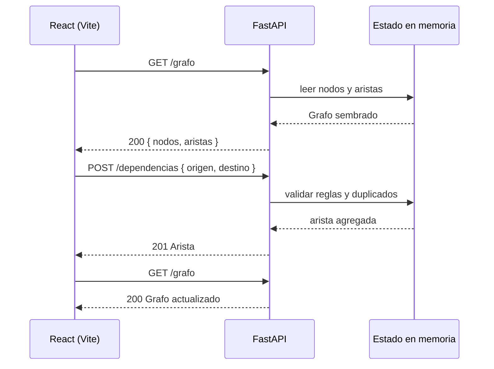

# Integración Feature 1: catálogo de dependencias con FastAPI

> Documento de diseño e integración. Los fragmentos de código son **propuestos** y deben aplicarse en una tarea de implementación posterior. La rama acordada es `feature/catalogo-dependencias` en ambos repositorios.

## 1. Decisiones de diseño

### 1.1 Alcance de esta guía

- Feature 1: crear/listar elementos y registrar/listar dependencias.
- Solo se documenta; esta entrega no modifica código.
- Se incluyen integración, validación del código actual, aceptación y plan de entrega.
- No se diseñan pantallas nuevas: el frontend consumirá la API con su interfaz actual.
- La lista de mejoras se limita a Feature 1 y a la integración frontend-backend.

### 1.2 Modelo del grafo

- `A -> B` significa **“A requiere B”**.
- Ejemplo: `producto -> insumo` = “Para producir el producto necesito el insumo”.
- Capas permitidas: `producto`, `insumo`, `proveedor`.
- `categoria` es opcional y no cambia la dirección de la relación.
- Reglas de dependencia:
  1. `producto -> insumo`
  2. `insumo -> proveedor`

### 1.3 Identificadores

- El cliente envía el `id` de un nodo nuevo.
- El backend valida que no esté vacío y que no exista otro nodo con ese `id`.
- No se impone una expresión regular estricta; se validan tipo, no vacío y unicidad.
- El backend genera el `id` de cada dependencia y fija `tipo: "REQUIERE"`.

### 1.4 Persistencia

- Estado en memoria, sembrado con `data.py`.
- Un reinicio del backend restaura el dataset inicial.
- No hay endpoint de reset.
- No se prueba el estado vacío: el backend siempre arranca con datos sembrados.
- No se detectan ciclos en Feature 1; esa responsabilidad pertenece a Feature 3.

### 1.5 Conexión frontend-backend

| Elemento | Valor acordado |
|---|---|
| Backend | `http://localhost:8000` |
| Frontend | `http://localhost:5173` |
| Variable | `VITE_API_BASE_URL=http://localhost:8000` |
| CORS | Origen `http://localhost:5173`, métodos `GET`, `POST`, `OPTIONS` |

## 2. Estado actual verificado

### 2.1 Backend (`grafos_math_back`, rama local `feature/catalogo-dependencias`)

Archivos presentes:

- `main.py`
- `models.py`
- `data.py`
- `requirements.txt`
- `README.md`
- `.gitignore`

Endpoints existentes hoy:

| Método | Ruta | Estado |
|---|---|---|
| `GET` | `/` | Salud de la API |
| `GET` | `/productos` | Lista productos |
| `GET` | `/insumos` | Lista insumos |
| `GET` | `/proveedores` | Lista proveedores |

Datos semilla: **12 nodos** y **18 aristas** en `MOCK_GRAFO`.

Lo que falta para Feature 1:

- `GET /grafo`, `GET /nodos`, `POST /nodos`.
- `GET /dependencias`, `POST /dependencias`.
- CORS.
- Validación server-side de duplicados y relaciones inválidas.
- Script de aceptación.

Nota sobre ramas: la rama local verificada contiene `models.py` y `data.py`. El remoto `origin/feature/catalogo-dependencias` puede tener un historial distinto con `GET /list-nodos` y la clave `node`. **El contrato de esta guía es el de la rama local**: `GET /grafo` con la clave `nodos`. La ruta histórica `/list-nodos` no forma parte del contrato acordado.

### 2.2 Frontend (`grafos_math_frontend`, rama `feature/catalogo-dependencias`)

| Pieza | Estado actual |
|---|---|
| `src/App.tsx` | Estado inicial con `MOCK_GRAFO`; sin llamadas de red |
| `src/features/graph/services/graphService.ts` | `getGraph()` tipado, pero no utilizado |
| `src/components/DependencyRegister.tsx` | Registro de dependencias solo en memoria |
| `src/features/graph/hooks/useDependencyRegistration.ts` | Validación y generación de `id` en el cliente |
| `src/features/graph/domain/dependencyRules.ts` | Reglas `producto -> insumo` e `insumo -> proveedor` |
| `src/data/mockGraph.ts` |12 nodos y18 aristas, igual que el backend actual |
| `vite.config.ts` | Sin proxy; se usará variable de entorno y CORS |

## 3. Contrato REST acordado

### 3.1 Tipos compartidos

```ts
export type Capa = 'producto' | 'insumo' | 'proveedor';

export interface Nodo {
  id: string;
  nombre: string;
  capa: Capa;
  categoria?: string;
}

export interface Arista {
  id: string;
  origen: string;
  destino: string;
  tipo: 'REQUIERE';
}

export interface Grafo {
  nodos: Nodo[];
  aristas: Arista[];
}

export interface NodoInput {
  id: string;
  nombre: string;
  capa: Capa;
  categoria?: string;
}

export interface DependenciaInput {
  origen: string;
  destino: string;
}
```

### 3.2 Endpoints

| Método | Ruta | Éxito | Entrada | Errores principales |
|---|---|---|---|---|
| `GET` | `/grafo` | `200` `{ nodos, aristas }` | Ninguna | — |
| `GET` | `/nodos` | `200` `Nodo[]` | Ninguna | — |
| `POST` | `/nodos` | `201` `Nodo` | `NodoInput` | `400`, `409`, `422` |
| `GET` | `/dependencias` | `200` `Arista[]` | Ninguna | — |
| `POST` | `/dependencias` | `201` `Arista` | `DependenciaInput` | `400`, `404`, `409`, `422` |

Los GET existentes por capa (`/productos`, `/insumos`, `/proveedores`) y `GET /` pueden conservarse como utilidades, pero la integración de Feature 1 solo debe depender de los cinco endpoints anteriores.

### 3.3 Códigos de respuesta

| Código | Cuándo |
|---|---|
| `200` | Lectura correcta |
| `201` | Elemento o dependencia creados |
| `400` | Regla de negocio violada: `id`/`nombre` vacíos, capas incompatibles o auto-relación |
| `404` | Nodo de origen o destino inexistente |
| `409` | `id` de nodo duplicado o par `origen -> destino` duplicado |
| `422` | Payload estructural inválido: campo faltante, tipo incorrecto o capa fuera del catálogo |

Los errores seguirán el formato estándar de FastAPI:

```json
{
  "detail": "Ya existe un nodo con id 'PRD-PAN'."
}
```

### 3.4 Ejemplos `curl`

```bash
# Red completa
curl http://localhost:8000/grafo

# Elementos
curl http://localhost:8000/nodos

# Crear elemento
curl -X POST http://localhost:8000/nodos \
  -H 'Content-Type: application/json' \
  -d '{"id":"PRD-AREPA","nombre":"Arepa de choclo","capa":"producto","categoria":"Panadería"}'

# Dependencias
curl http://localhost:8000/dependencias

# Crear dependencia
curl -X POST http://localhost:8000/dependencias \
  -H 'Content-Type: application/json' \
  -d '{"origen":"PRD-AREPA","destino":"INS-HARINA"}'

# Relación inválida: producto -> proveedor
curl -i -X POST http://localhost:8000/dependencias \
  -H 'Content-Type: application/json' \
  -d '{"origen":"PRD-PAN","destino":"PRV-MATERIAPRIMA"}'
```

## 4. Backend: pasos de integración

### 4.1 Requisitos y arranque

Se asume una rama limpia en `feature/catalogo-dependencias`.

```bash
cd ../grafos_math_back
git branch --show-current
python3.12 -m venv .venv
source .venv/bin/activate
pip install -r requirements.txt
uvicorn main:app --reload --port 8000
```

Verificación rápida:

```bash
curl http://localhost:8000/
curl http://localhost:8000/productos
```

### 4.2 CORS

Añadir al inicio de `main.py`, después de crear `app`:

```python
from fastapi.middleware.cors import CORSMiddleware

app.add_middleware(
    CORSMiddleware,
    allow_origins=["http://localhost:5173"],
    allow_methods=["GET", "POST", "OPTIONS"],
    allow_headers=["Content-Type"],
)
```

Sin este paso, el navegador bloqueará las peticiones desde Vite.

### 4.3 Modelos de entrada

Añadir en `models.py`:

```python
class NodoEntrada(BaseModel):
    id: str
    nombre: str
    capa: Capa
    categoria: Optional[str] = None


class DependenciaEntrada(BaseModel):
    origen: str
    destino: str
```

`NodoEntrada` y `DependenciaInput` son interfaces pequeñas y específicas: el cliente no envía campos que solo debe asignar el servidor, como el `id` de una arista o su `tipo`.

### 4.4 Endpoints propuestos

Añadir en `main.py`:

```python
from typing import List

from fastapi import FastAPI, HTTPException

from data import MOCK_GRAFO
from models import (
    Arista,
    DependenciaEntrada,
    Grafo,
    Nodo,
    NodoEntrada,
)

app = FastAPI()

REGLAS_DEPENDENCIA = {
    ("producto", "insumo"),
    ("insumo", "proveedor"),
}


def siguiente_id_arista() -> str:
    indice = len(MOCK_GRAFO.aristas) + 1
    while any(arista.id == f"e{indice:02d}" for arista in MOCK_GRAFO.aristas):
        indice += 1
    return f"e{indice:02d}"


@app.get("/grafo", response_model=Grafo)
def obtener_grafo():
    return MOCK_GRAFO


@app.get("/nodos", response_model=List[Nodo])
def listar_nodos():
    return MOCK_GRAFO.nodos


@app.post("/nodos", response_model=Nodo, status_code=201)
def crear_nodo(entrada: NodoEntrada):
    id_limpio = entrada.id.strip()
    nombre_limpio = entrada.nombre.strip()

    if not id_limpio or not nombre_limpio:
        raise HTTPException(
            status_code=400,
            detail="El id y el nombre no pueden estar vacíos.",
        )

    if any(nodo.id == id_limpio for nodo in MOCK_GRAFO.nodos):
        raise HTTPException(
            status_code=409,
            detail=f"Ya existe un nodo con id '{id_limpio}'.",
        )

    nodo = Nodo(
        id=id_limpio,
        nombre=nombre_limpio,
        capa=entrada.capa,
        categoria=entrada.categoria,
    )
    MOCK_GRAFO.nodos.append(nodo)
    return nodo


@app.get("/dependencias", response_model=List[Arista])
def listar_dependencias():
    return MOCK_GRAFO.aristas


@app.post("/dependencias", response_model=Arista, status_code=201)
def crear_dependencia(entrada: DependenciaEntrada):
    nodos = {nodo.id: nodo for nodo in MOCK_GRAFO.nodos}
    origen = nodos.get(entrada.origen)
    destino = nodos.get(entrada.destino)

    if origen is None or destino is None:
        raise HTTPException(
            status_code=404,
            detail="El origen o el destino no existe.",
        )

    if (origen.capa, destino.capa) not in REGLAS_DEPENDENCIA:
        raise HTTPException(
            status_code=400,
            detail="La dependencia no sigue una relación permitida.",
        )

    duplicada = any(
        arista.origen == origen.id and arista.destino == destino.id
        for arista in MOCK_GRAFO.aristas
    )
    if duplicada:
        raise HTTPException(
            status_code=409,
            detail="La dependencia ya está registrada.",
        )

    arista = Arista(
        id=siguiente_id_arista(),
        origen=origen.id,
        destino=destino.id,
        tipo="REQUIERE",
    )
    MOCK_GRAFO.aristas.append(arista)
    return arista
```

Notas:

- `MOCK_GRAFO` pasa a ser estado mutable de la demo; un reinicio lo restaura.
- Una auto-relación (`origen == destino`) cae en `400` porque esa pareja de capas no está permitida.
- `capa` inválida o campo ausente produce `422` desde Pydantic antes de entrar a la función.
- El backend es la autoridad: las validaciones del frontend son solo experiencia de usuario.

### 4.5 Verificación manual

```bash
curl -i http://localhost:8000/grafo
curl -i http://localhost:8000/nodos
curl -i http://localhost:8000/dependencias

curl -i -X POST http://localhost:8000/nodos \
  -H 'Content-Type: application/json' \
  -d '{"id":"PRD-AREPA","nombre":"Arepa de choclo","capa":"producto"}'

curl -i -X POST http://localhost:8000/nodos \
  -H 'Content-Type: application/json' \
  -d '{"id":"PRD-AREPA","nombre":"Duplicado","capa":"producto"}'

curl -i -X POST http://localhost:8000/dependencias \
  -H 'Content-Type: application/json' \
  -d '{"origen":"PRD-PAN","destino":"NO-EXISTE"}'
```

## 5. Frontend: pasos de integración

### 5.1 Variables de entorno

Crear `.env.local` (está ignorado por Git):

```bash
VITE_API_BASE_URL=http://localhost:8000
```

Crear también `.env.example` para documentar la variable requerida:

```bash
VITE_API_BASE_URL=http://localhost:8000
```

### 5.2 Extender el servicio de datos

`graphService.ts` debe pasar de un único `getGraph()` a una fuente de datos completa, manteniendo la inyección del `fetcher`:

```ts
import type { Arista, Capa, DependenciaInput, Grafo, Nodo, NodoInput } from '../types';

export interface GraphDataSource {
  getGraph(): Promise<Grafo>;
  getNodes(): Promise<Nodo[]>;
  createNode(input: NodoInput): Promise<Nodo>;
  getDependencies(): Promise<Arista[]>;
  createDependency(input: DependenciaInput): Promise<Arista>;
}

export function createGraphDataSource(
  fetcher: typeof fetch,
  baseUrl: string,
): GraphDataSource {
  const url = (path: string) => `${baseUrl.replace(/\/$/, '')}${path}`;

  const request = async <T>(path: string, init?: RequestInit): Promise<T> => {
    const response = await fetcher(url(path), init);
    if (!response.ok) {
      const detail = await response.text();
      throw new Error(`Error HTTP ${response.status}: ${detail}`);
    }
    return response.json() as Promise<T>;
  };

  const post = <T>(path: string, body: unknown) =>
    request<T>(path, {
      method: 'POST',
      headers: { 'Content-Type': 'application/json' },
      body: JSON.stringify(body),
    });

  return {
    getGraph: () => request<Grafo>('/grafo'),
    getNodes: () => request<Nodo[]>('/nodos'),
    createNode: (input) => post<Nodo>('/nodos', input),
    getDependencies: () => request<Arista[]>('/dependencias'),
    createDependency: (input) => post<Arista>('/dependencias', input),
  };
}
```

Uso:

```ts
const baseUrl = import.meta.env.VITE_API_BASE_URL as string;

export const graphApi = createGraphDataSource(
  (input, init) => fetch(input, init),
  baseUrl,
);
```

Se envuelve `fetch` en una función flecha para no extraer el método del objeto `window`.

### 5.3 Cargar el grafo con estados asíncronos

La aplicación debe dejar de tratar `MOCK_GRAFO` como fuente de verdad en tiempo de ejecución. El mock puede quedarse para pruebas unitarias, pero no como respaldo silencioso si la API falla.

Estados mínimos:

| Estado | Significado |
|---|---|
| `cargando` | Solicitud en vuelo |
| `listo` | Grafo disponible |
| `error` | La API no respondió o devolvió un error |

Patrón recomendado con limpieza del efecto:

```ts
useEffect(() => {
  let activo = true;

  setEstado('cargando');
  graphApi
    .getGraph()
    .then((data) => {
      if (!activo) return;
      setGrafo(data);
      setEstado('listo');
    })
    .catch((cause: unknown) => {
      if (!activo) return;
      setError(cause instanceof Error ? cause.message : 'Error desconocido');
      setEstado('error');
    });

  return () => {
    activo = false;
  };
}, []);
```

En `App.tsx`:

- `cargando`: mostrar un mensaje con `role="status"`.
- `error`: mostrar el mensaje con `role="alert"`.
- `listo`: renderizar `HomePage`, `VisualizationPage` y `DependencyRegister` con el grafo recibido.

### 5.4 Registrar dependencias contra la API

Hoy `useDependencyRegistration` genera el `id` de la arista y llama `onAdd` solo en memoria. La versión integrada debe:

1. Mantener las validaciones locales de capa y duplicados para responder rápido al usuario.
2. Enviar `{ origen, destino }` a `POST /dependencias`.
3. Usar la `Arista` devuelta por el backend.
4. Recargar el grafo con `GET /grafo` después del éxito.
5. Mostrar el `detail` del backend si la respuesta no fue `201`.

```ts
const registrar = async (event: FormEvent<HTMLFormElement>) => {
  event.preventDefault();

  // Validaciones locales existentes...

  try {
    await graphApi.createDependency({ origen: originId, destino: targetId });
    await recargarGrafo();
    setTargetId('');
    setMessage('Dependencia registrada correctamente.');
  } catch (cause) {
    setMessage(
      cause instanceof Error
        ? cause.message
        : 'No se pudo registrar la dependencia.',
    );
  }
};
```

La generación local `e${...}` deja de ser la fuente del `id` de arista.

### 5.5 Crear y listar elementos

Feature 1 expone creación/listado de elementos mediante API. En esta entrega **no se agrega un formulario nuevo**:

- Listado observable: `GET /nodos`, `GET /grafo` y la red ya renderizada por `VisualizationPage`.
- Creación observable: `curl` y el script de aceptación.
- Después de crear un nodo por API, recargar el frontend para verlo en el grafo.

Esto es un trade-off deliberado frente al brief: la capacidad existe en la API y la aceptación, pero la interfaz actual no incluye un alta de elementos.

## 6. Diagrama de integración



## 7. Script de aceptación

### 7.1 Ubicación y ejecución

- Repositorio: backend.
- Archivo propuesto: `scripts/aceptacion_feature1.py`.
- Lenguaje: Python con librería estándar.
- No requiere `pytest`, mocks ni cobertura.

```bash
cd ../grafos_math_back
source .venv/bin/activate
python scripts/aceptacion_feature1.py
python scripts/aceptacion_feature1.py | tee aceptacion_feature1.txt
```

### 7.2 Escenarios

| # | Escenario | Esperado |
|---|---|---|
|1| `GET /grafo` | `200`, listas `nodos` y `aristas`, contiene `PRD-PAN` |
|2| `GET /nodos` | `200`, lista no vacía |
|3| `GET /dependencias` | `200`, contiene `e01` |
|4| Crear nodo origen válido | `201` y el `id` devuelto coincide |
|5| Listar nodos tras crear | `200` y contiene el nuevo nodo |
|6| Crear nodo destino válido | `201` |
|7| Repetir `id` de nodo | `409` |
|8| `id` vacío | `400` |
|9| Capa fuera del catálogo | `422` |
|10| Nombre faltante | `422` |
|11| Crear dependencia válida | `201` y `tipo = REQUIERE` |
|12| Listar tras crear dependencia | `200` y contiene el par |
|13| Repetir la misma dependencia | `409` |
|14| Origen inexistente | `404` |
|15| Capas incompatibles | `400` |
|16| Auto-relación | `400` |

No se incluyen estado vacío ni ciclo:

- Estado vacío: no aplica porque el backend siempre arranca con `MOCK_GRAFO`.
- Ciclo: Feature 1 solo permite avanzar de `producto` a `insumo` a `proveedor`; la detección de ciclos es Feature 3.

### 7.3 Script propuesto

```python
import json
import os
import sys
import urllib.error
import urllib.request
import uuid

BASE_URL = os.getenv("API_URL", "http://localhost:8000").rstrip("/")
FALLAS = 0


def mostrar(valor):
    if isinstance(valor, (dict, list)):
        return json.dumps(valor, ensure_ascii=False)
    return str(valor)


def pedir(metodo, ruta, cuerpo=None):
    datos = None
    encabezados = {}

    if cuerpo is not None:
        datos = json.dumps(cuerpo, ensure_ascii=False).encode("utf-8")
        encabezados["Content-Type"] = "application/json"

    solicitud = urllib.request.Request(
        f"{BASE_URL}{ruta}",
        data=datos,
        headers=encabezados,
        method=metodo,
    )

    try:
        with urllib.request.urlopen(solicitud) as respuesta:
            estado = respuesta.status
            texto = respuesta.read().decode("utf-8")
    except urllib.error.HTTPError as error:
        estado = error.code
        texto = error.read().decode("utf-8")

    if not texto:
        return estado, None

    try:
        return estado, json.loads(texto)
    except json.JSONDecodeError:
        return estado, texto


def informar(nombre, esperado, obtenido, condicion):
    global FALLAS
    resultado = "PASÓ" if condicion else "FALLÓ"
    if not condicion:
        FALLAS += 1

    print(f"[{resultado}] {nombre}")
    print(f"  Esperado: {mostrar(esperado)}")
    print(f"  Obtenido: {mostrar(obtenido)}")
    print("")


def main():
    marca = uuid.uuid4().hex[:8]
    origen_id = f"TEST-PRD-{marca}"
    destino_id = f"TEST-INS-{marca}"

    estado, grafo = pedir("GET", "/grafo")
    informar(
        "GET /grafo devuelve la red",
        "200 con listas nodos y aristas",
        {"status": estado, "body": grafo},
        estado == 200
        and isinstance(grafo, dict)
        and isinstance(grafo.get("nodos"), list)
        and isinstance(grafo.get("aristas"), list)
        and any(nodo.get("id") == "PRD-PAN" for nodo in grafo["nodos"]),
    )

    estado, nodos = pedir("GET", "/nodos")
    informar(
        "GET /nodos lista elementos",
        "200 con al menos un nodo",
        {"status": estado, "body": nodos},
        estado == 200
        and isinstance(nodos, list)
        and any(nodo.get("id") == "PRD-PAN" for nodo in nodos),
    )

    estado, dependencias = pedir("GET", "/dependencias")
    informar(
        "GET /dependencias lista relaciones",
        "200 con al menos una arista",
        {"status": estado, "body": dependencias},
        estado == 200
        and isinstance(dependencias, list)
        and any(arista.get("id") == "e01" for arista in dependencias),
    )

    estado, nodo_creado = pedir(
        "POST",
        "/nodos",
        {
            "id": origen_id,
            "nombre": "Nodo origen de prueba",
            "capa": "producto",
        },
    )
    informar(
        "POST /nodos crea un elemento válido",
        "201 con el id enviado",
        {"status": estado, "body": nodo_creado},
        estado == 201
        and isinstance(nodo_creado, dict)
        and nodo_creado.get("id") == origen_id,
    )

    estado, nodos = pedir("GET", "/nodos")
    informar(
        "El nodo creado queda en el listado",
        "200 con el id creado",
        {"status": estado, "contiene": origen_id in [n.get("id") for n in nodos]},
        estado == 200
        and isinstance(nodos, list)
        and any(nodo.get("id") == origen_id for nodo in nodos),
    )

    estado, nodo_destino = pedir(
        "POST",
        "/nodos",
        {
            "id": destino_id,
            "nombre": "Nodo destino de prueba",
            "capa": "insumo",
        },
    )
    informar(
        "POST /nodos crea el segundo elemento",
        "201",
        {"status": estado, "body": nodo_destino},
        estado == 201,
    )

    estado, cuerpo = pedir(
        "POST",
        "/nodos",
        {
            "id": origen_id,
            "nombre": "Elemento duplicado",
            "capa": "producto",
        },
    )
    informar(
        "POST /nodos rechaza id duplicado",
        "409",
        {"status": estado, "body": cuerpo},
        estado == 409,
    )

    estado, cuerpo = pedir(
        "POST",
        "/nodos",
        {"id": " ", "nombre": "Sin id", "capa": "producto"},
    )
    informar(
        "POST /nodos rechaza id vacío",
        "400",
        {"status": estado, "body": cuerpo},
        estado == 400,
    )

    estado, cuerpo = pedir(
        "POST",
        "/nodos",
        {
            "id": f"TEST-CAPA-{marca}",
            "nombre": "Capa inválida",
            "capa": "magia",
        },
    )
    informar(
        "POST /nodos rechaza capa fuera del catálogo",
        "422",
        {"status": estado, "body": cuerpo},
        estado == 422,
    )

    estado, cuerpo = pedir(
        "POST",
        "/nodos",
        {"id": f"TEST-NOMBRE-{marca}", "capa": "producto"},
    )
    informar(
        "POST /nodos rechaza nombre faltante",
        "422",
        {"status": estado, "body": cuerpo},
        estado == 422,
    )

    estado, arista = pedir(
        "POST",
        "/dependencias",
        {"origen": origen_id, "destino": destino_id},
    )
    informar(
        "POST /dependencias crea una relación válida",
        "201 con tipo REQUIERE",
        {"status": estado, "body": arista},
        estado == 201
        and isinstance(arista, dict)
        and arista.get("tipo") == "REQUIERE"
        and arista.get("origen") == origen_id
        and arista.get("destino") == destino_id,
    )

    estado, dependencias = pedir("GET", "/dependencias")
    informar(
        "La dependencia creada queda en el listado",
        "200 con el par creado",
        {"status": estado, "contiene": True},
        estado == 200
        and isinstance(dependencias, list)
        and any(
            arista.get("origen") == origen_id
            and arista.get("destino") == destino_id
            for arista in dependencias
        ),
    )

    estado, cuerpo = pedir(
        "POST",
        "/dependencias",
        {"origen": origen_id, "destino": destino_id},
    )
    informar(
        "POST /dependencias rechaza relación duplicada",
        "409",
        {"status": estado, "body": cuerpo},
        estado == 409,
    )

    estado, cuerpo = pedir(
        "POST",
        "/dependencias",
        {"origen": f"NO-EXISTE-{marca}", "destino": destino_id},
    )
    informar(
        "POST /dependencias rechaza origen inexistente",
        "404",
        {"status": estado, "body": cuerpo},
        estado == 404,
    )

    estado, cuerpo = pedir(
        "POST",
        "/dependencias",
        {"origen": "PRD-PAN", "destino": "PRV-MATERIAPRIMA"},
    )
    informar(
        "POST /dependencias rechaza capas incompatibles",
        "400",
        {"status": estado, "body": cuerpo},
        estado == 400,
    )

    estado, cuerpo = pedir(
        "POST",
        "/dependencias",
        {"origen": "PRD-PAN", "destino": "PRD-PAN"},
    )
    informar(
        "POST /dependencias rechaza auto-relación",
        "400",
        {"status": estado, "body": cuerpo},
        estado == 400,
    )

    if FALLAS:
        print(f"Resultado: {FALLAS} escenario(s) fallaron.")
        sys.exit(1)

    print("Resultado: todos los escenarios pasaron.")
    sys.exit(0)


if __name__ == "__main__":
    main()
```

### 7.4 Salida esperada

Cada escenario debe imprimir:

- nombre del escenario;
- valor esperado;
- valor obtenido;
- `PASÓ` o `FALLÓ`.

Si todo funciona, el proceso termina con código `0`. Si algo falla, termina con código `1`.

## 8. Validación del código actual y mejoras priorizadas

### 8.1 Bloqueantes (`P0`)

| Mejora | Por qué bloquea |
|---|---|
| Implementar los cinco endpoints acordados | Hoy no existen `POST` ni `GET /grafo` |
| Configurar CORS | Sin él, Vite no puede consumir FastAPI |
| Cablear `graphService` en la aplicación | El servicio existe pero nadie lo importa |
| Reemplazar `MOCK_GRAFO` como fuente de ejecución | La demo no prueba integración real mientras use solo el mock |
| Añadir estados de carga y error | Todo flujo asíncrono debe ser observable |
| Crear `scripts/aceptacion_feature1.py` | La feature no es demostrable sin aceptación |
| Sincronizar la rama local del backend con el remoto | Los contratos históricos difieren y confundirían al equipo |

### 8.2 Recomendadas (`P1`)

| Mejora | Observación |
|---|---|
| Mover la autoridad de validación al backend | El frontend conserva sus reglas solo como UX |
| Dejar de generar `id` de arista en el cliente | El servidor pasa a ser responsable del id |
| Añadir `.env.example` | Documenta `VITE_API_BASE_URL` sin exponer valores locales |
| Validar en runtime la respuesta del backend | Hoy `response.json() as T` solo afirma el tipo |
| Documentar o retirar los GET por capa | No son parte del contrato de Feature 1 |
| Añadir alta de elementos en la interfaz | Pendiente frente al brief; hoy la creación es por API |

### 8.3 Deuda menor (`P2`)

- Renombrar `MOCK_GRAFO` a un nombre de estado mutable, por ejemplo `estado_grafo`.
- El estado global mutable no está pensado para concurrencia real; es aceptable para la demo.
- El frontend y el backend mantienen copias del mock; después de integrar, el backend debe ser la fuente de verdad.

## 9. Aplicación de principios SOLID

| Pieza | Principio | Aplicación |
|---|---|---|
| `graphService.ts` | Inversión de dependencias (D) | Los componentes dependen de `GraphDataSource`, no de `fetch` concreto |
| Servicio, hook y componentes | Responsabilidad única (S) | Red, estado asíncrono y presentación están separados |
| `NodoInput` / `DependenciaInput` | Segregación de interfaces (I) | El cliente solo envía los campos que realmente controla |
| `REGLAS_DEPENDENCIA` | Abierto/cerrado (O) | Nuevas reglas se agregan al conjunto sin reescribir endpoints |
| Mock y API sobre la misma interfaz | Sustitución de Liskov (L) | Cualquier fuente que cumpla `GraphDataSource` es intercambiable |
| Callbacks `onSelect`, `onAdd`, `onBack` | Composición (O) | Las vistas se especializan por props en lugar de heredar |

## 10. Trade-offs y riesgos

1. **Persistencia en memoria**: los datos creados se pierden al reiniciar. Aceptado para la demo sintética.
2. **Sin formulario de elementos**: la creación/listado de nodos se demuestra por API y aceptación; el brief pedía una interfaz mínima y esto queda como mejora `P1`.
3. **Doble validación**: frontend y backend validan las mismas reglas. Es aceptable solo si el backend queda como autoridad.
4. **Documentación sin implementación**: los snippets aún no se ejecutaron contra el backend; la aceptación debe ejecutarlos después de codificar.
5. **Rama local/remota divergentes**: si otro integrante usa el remoto, puede obtener un contrato distinto. Debe sincronizarse antes del trabajo en equipo.
6. **CORS de desarrollo**: `localhost:5173` no sirve para despliegue; production necesita configuración propia.
7. **IDs de arista secuenciales**: son simples, pero el helper debe evitar colisiones si se borran o insertan datos manualmente.
8. **Estado vacío y ciclos**: quedan fuera de esta aceptación por decisión de alcance; deben retomarse en Features 2 y 3.

Contra buenas prácticas:

- Usar `MOCK_GRAFO` como estado mutable global es cómodo, pero no escala; se justifica solo mientras no haya base de datos.
- `response.json() as T` no valida estructura; es mejor que `any`, pero no es validación real.
- Mantener la creación de elementos fuera de la interfaz reduce el valor visible de Feature 1 frente al brief. Es un trade-off consciente, no una solución definitiva.

## 11. Prueba unitaria complementaria

Además del script de aceptación, las reglas de dominio del frontend pueden probarse con Vitest:

```ts
import { describe, expect, it } from 'vitest';
import {
  esDependenciaPermitida,
  siguienteCapa,
} from './dependencyRules';
import type { Nodo } from '../types';

const nodo = (id: string, capa: Nodo['capa']): Nodo => ({
  id,
  nombre: id,
  capa,
});

describe('dependencyRules', () => {
  it('permite producto -> insumo y rechaza producto -> proveedor', () => {
    expect(
      esDependenciaPermitida(nodo('a', 'producto'), nodo('b', 'insumo')),
    ).toBe(true);
    expect(
      esDependenciaPermitida(nodo('a', 'producto'), nodo('b', 'proveedor')),
    ).toBe(false);
  });

  it('describe el avance de capas permitido', () => {
    expect(siguienteCapa('producto')).toBe('insumo');
    expect(siguienteCapa('insumo')).toBe('proveedor');
    expect(siguienteCapa('proveedor')).toBeNull();
  });
});
```

## 12. Plan de entrega de la feature

### 12.1 Implementación

- [ ] Backend: modelos de entrada.
- [ ] Backend: CORS.
- [ ] Backend: `GET /grafo`.
- [ ] Backend: `GET /nodos` y `POST /nodos`.
- [ ] Backend: `GET /dependencias` y `POST /dependencias`.
- [ ] Frontend: `.env.local` y `.env.example`.
- [ ] Frontend: tipos `NodoInput` y `DependenciaInput`.
- [ ] Frontend: `GraphDataSource` completo.
- [ ] Frontend: carga del grafo con estados `cargando` / `listo` / `error`.
- [ ] Frontend: `DependencyRegister` contra `POST /dependencias`.
- [ ] Frontend: limpieza de efectos asíncronos.

### 12.2 Verificación

```bash
# Backend
curl -i http://localhost:8000/grafo
curl -i http://localhost:8000/nodos
curl -i http://localhost:8000/dependencias

# Aceptación
python scripts/aceptacion_feature1.py

# Frontend
npm run lint
npm run build
npm test
```

Criterios de terminado:

- Todos los escenarios de aceptación imprimen `PASÓ`.
- La pestaña Network del navegador muestra llamadas a `http://localhost:8000`.
- La aplicación no usa `MOCK_GRAFO` como fuente de verdad en ejecución.
- Los errores de API se muestran al usuario.
- Lint, build y tests del frontend pasan.

### 12.3 Documentación y entrega docente

- [ ] README del backend: propósito, instalación, ejecución, endpoints y decisiones.
- [ ] README del frontend: variable de entorno, integración y ejecución.
- [ ] Guardar la salida del script de aceptación.
- [ ] Actualizar `bitacora.md` con esta decisión de diseño.
- [ ] Tag o release de la feature una vez implementada.
- [ ] Video de máximo tres minutos.
- [ ] Pitch asignado:7 minutos de demo y3 de preguntas.
- [ ] Enlaces a commits, PRs y revisiones del equipo.

Fila sugerida para la bitácora de IA:

| Decisión o pieza | Herramienta/objetivo de IA | Propuesta recibida | Acepté o rechacé y por qué | Cómo la verifiqué |
|---|---|---|---|---|
| Guía de integración Feature1 | Redactar diseño e integración | Contrato REST, pasos y aceptación | Aceptada con ajustes de alcance y validación server-side | Lectura de `main.py`, `models.py`, `data.py`, servicios frontend y ramas git |
